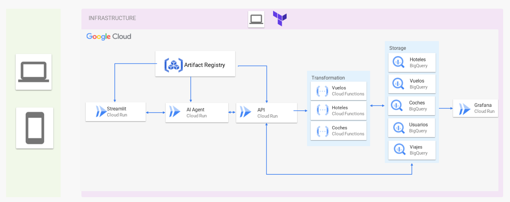

# DataProject_3

## Descripción General del Proyecto

Este proyecto es una aplicación de chat para la planificación de vacaciones que utiliza un sistema multiagente. La aplicación cuenta con un frontend en Streamlit para la interacción del usuario, que se comunica con una API backend impulsada por un agente de IA diseñado para ayudar a los usuarios a planificar sus viajes.

El proyecto consta de tres componentes principales:

1.  **Frontend Streamlit**: Una interfaz de chat donde los usuarios pueden interactuar con el agente de planificación de vacaciones.
2.  **API del Agente**: Una aplicación FastAPI que integra el sistema multiagente (potencialmente utilizando Langraph) que procesa las consultas del usuario relacionadas con la planificación de vacaciones.
3.  **API de Datos**: Una aplicación FastAPI que proporciona los datos necesarios (como hoteles, vuelos, coches, información de usuario y detalles de viaje) al agente de IA.

## Instrucciones de despliegue en local

1.  **Clonar el Repositorio**:

    ```bash
    git clone <repository-url>
    cd DataProject_3
    ```

2.  **Crear archivo .env**

    ```text
    GOOGLE_API_KEY = <GOOGLE_API_KEY>
    SERPAPI_KEY = <SERPAPI_KEY>
    RAPIDAPI_KEY = <RAPIDAPI_KEY>
    DATA_API_URL = <DATA_API_URL>
    AGENT_API_URL = <AGENT_API_URL>
    ```

3.  **Docker compose up**:

    ```bash
    docker compose -f 'docker-compose.yml' up -d --build
    ```

## Arquitectura de Despliegue en GCP



La aplicación se despliega en Google Cloud Platform (GCP) utilizando los siguientes servicios:

-   **Streamlit (Cloud Run)**: Aloja la interfaz de chat del frontend.
-   **Artifact Registry**: Utilizado para almacenar imágenes de contenedor.
-   **Agente de IA (Cloud Run)**: Aloja la API backend con el sistema multiagente.
-   **API (Cloud Run)**: Aloja la API de datos.
-   **Transformación (Cloud Functions)**: Incluye Cloud Functions para procesar datos relacionados con Vuelos, Hoteles y Coches.
-   **Almacenamiento (BigQuery)**: Almacena datos en tablas de BigQuery para Hoteles, Vuelos, Coches, Usuarios y Viajes.
-   **Grafana (Cloud Run)**: Desplegado para monitorización y visualización.

El flujo de datos implica que el frontend Streamlit interactúa con la API del Agente de IA, que a su vez se comunica con la API de Datos y las Cloud Functions de Transformación. Las funciones de Transformación interactúan con el almacenamiento de BigQuery. El Agente de IA también interactúa directamente con la API de Datos. La API de Datos también interactúa con BigQuery para los datos de Viajes. Artifact Registry está conectado a Streamlit y al Agente de IA. Grafana se conecta a BigQuery para la monitorización.