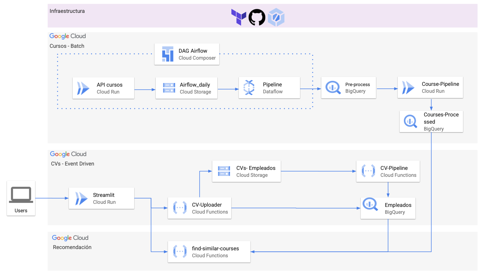

# TFM CaixaBank: Intelligent Course Recommendation System 

<div align="center">

<div style="display: flex; justify-content: center; align-items: center; gap: 40px; margin: 20px 0;">
  
  
  
</div>

</div>

---

<div align="center">
<h3> <i>Comprehensive solution for intelligent data management and personalized recommendations</i></h3>
<p><b>Integrating modern orchestration, cloud, data pipelines and web applications</b></p>
</div>

---

## 📋 Table of Contents

- 🎯 [General Description](#-general-description)
- 🏗️ [Project Structure](#️-project-structure)
- ⚙️ [Main Components](#️-main-components)
  - 🔄 [Airflow (Pipeline Orchestration)](#-airflow-pipeline-orchestration)
  - 🚀 [API](#-api)
  - ☁️ [Cloud Functions](#️-cloud-functions)
  - 📊 [Dataflow](#-dataflow)
  - 🖥️ [Frontend](#️-frontend)
  - 🏗️ [Terraform (IaC)](#️-terraform-infrastructure-as-code)
- 📦 [Requirements](#-requirements)
- 🚀 [How to Run](#-how-to-run)
- 📄 [License](#-license)

---

## 🎯 General Description

> **Transforming corporate training with Artificial Intelligence**

This project represents an **innovative solution** for CaixaBank that addresses the challenge of creating personalized training recommendations without relying on historical user interaction data.

### ✨ **Key Features**
- 🧠 **No-Feedback Recommendation System**: Works from day one
- 📊 **Processing +18,000 courses**: Enterprise scalability
- 🎯 **Advanced Personalization**: Based on deep semantic analysis
- ⚡ **Cloud-Native Architecture**: Deployed on Google Cloud Platform
- 🔄 **Automated Pipelines**: Intelligent orchestration with Airflow

---

## 🏗️ Project Structure

```
🏢 TFM_Caixabank/
┃
┣── 🐳 airflow-docker/           # Pipeline orchestration with Apache Airflow
┣── 🚀 API/                     # REST API for interaction and processing
┣── ☁️  cloud-functions/         # Serverless functions on GCP
┃   ┣── 📄 cv-pipeline/          # Intelligent CV analysis
┃   ┣── 🔍 find-similar-courses/ # Recommendation engine
┃   ┣── 🎯 recomendacion-semantica/
┃   ┗── 📈 recomendacion-gap-rol/
┣── 🔄 dataflow_courses/        # Distributed pipelines (Apache Beam)
┣── 🖥️  front/                   # Interactive web interface (Streamlit)
┣── 🏗️  terraform/               # Infrastructure as Code
┣── 📦 cloudbuild.yaml          # CI/CD Pipeline
┗── 📋 requirements.txt         # Project dependencies
```

---

## ⚙️ Main Components

<div align="center">
  
  <br><i>🏗️ Hybrid Architecture: Batch + Event-Driven Processing</i>
</div>

---

### 🔄 Airflow (Pipeline Orchestration)

- **📍 Location:** `airflow-docker/`
- **🔧 Technology:** Apache Airflow + Docker + Cloud Composer
- **⚡ Features:**
  - 📅 Daily automated batch processing
  - 🛡️ Fault tolerance and automatic recovery
  - 📊 Real-time pipeline monitoring
  - 🔄 Auto-scaling based on demand

**📂 Key Files:**
- `docker-compose.yaml`: Containerized deployment
- `dags/`: Orchestration and processing scripts

---

### 🚀 API

- **📍 Location:** `API/`
- **🔧 Technology:** Python + FastAPI + Cloud Run
- **⚡ Features:**
  - 🔍 Semantic search APIs
  - 📊 Data analysis endpoints
  - 🎯 Personalized recommendation services
  - 📈 Real-time performance metrics

**📂 Key Files:**
- `api_server.py`: Main FastAPI server
- `Dockerfile`: Containerization for Cloud Run

---

### ☁️ Cloud Functions

- **📍 Location:** `cloud-functions/`
- **🔧 Technology:** Google Cloud Functions + Python
- **⚡ Specialized Functions:**
  - 📄 `cv-pipeline/`: AI-powered CV analysis
  - 🔍 `find-similar-courses/`: Recommendation engine
  - 🎯 `recomendacion-semantica/`: Semantic search
  - 📈 `recomendacion-gap-rol/`: Skill gap analysis

**🚀 Scalability:** Infinite auto-scaling + Pay-per-use

---

### 📊 Dataflow

- **📍 Location:** `dataflow_courses/`
- **🔧 Technology:** Apache Beam + Google Dataflow
- **⚡ Features:**
  - 📊 Processing +18,000 courses simultaneously
  - 🔄 Distributed and parallel ETL
  - 🧠 Semantic enrichment with LLMs
  - 📈 Automatic resource optimization

**📂 Main File:**
- `courses_pipeline_fixed.py`: Course transformation pipeline

---

### 🖥️ Frontend

- **📍 Location:** `front/`
- **🔧 Technology:** Streamlit + Cloud Run
- **⚡ Features:**
  - 📊 Interactive metrics dashboard
  - 🔍 Advanced thematic search
  - 📄 CV upload and analysis
  - 🎯 Recommendation visualization

**📂 Structure:**
- `app.py`: Main application
- `pages/`: Functionality modules

---

### 🏗️ Terraform (Infrastructure as Code)

- **📍 Location:** `terraform/`
- **🔧 Technology:** Terraform + Google Cloud Platform
- **⚡ Managed Resources:**
  - 🗄️ BigQuery datasets and tables
  - ☁️ Cloud Functions and Cloud Run
  - 🔄 Cloud Composer and Dataflow
  - 🔐 IAM and granular security

**🎯 Benefits:** Automated deployment + Disaster Recovery

---

## 📦 Requirements

### 🛠️ **Required Tools**
- 🐳 **Docker** and Docker Compose
- 🐍 **Python 3.8+** 
- ☁️ **Google Cloud SDK** configured
- 🏗️ **Terraform >= 1.0**
- 🔑 **GCP Account** with administrative permissions

### 📚 **Dependencies**
Check the `requirements.txt` files in each component for specific dependencies.

---

## 🚀 How to Run

### 🔄 **Local Deployment (Development)**

```bash
# 1️⃣ Clone repository
git clone https://github.com/raulalgora/TFM_Caixabank.git
cd TFM_Caixabank

# 2️⃣ Start Airflow
cd airflow-docker && docker-compose up -d

# 3️⃣ Deploy API
cd ../API && docker build -t tfm_api . && docker run -p 8000:8000 tfm_api

# 4️⃣ Run Frontend
cd ../front && streamlit run app.py
```

### ☁️ **Production Deployment (GCP)**

```bash
# 5️⃣ Infrastructure
cd terraform && terraform init && terraform apply

# 6️⃣ Cloud Functions
cd ../cloud-functions && ./deploy_all_functions.sh
```

---

## 📄 License

<div align="center">

This project is under the **MIT License**. 

🏦 **Developed in collaboration with CaixaBank Tech** 🏦

</div>
